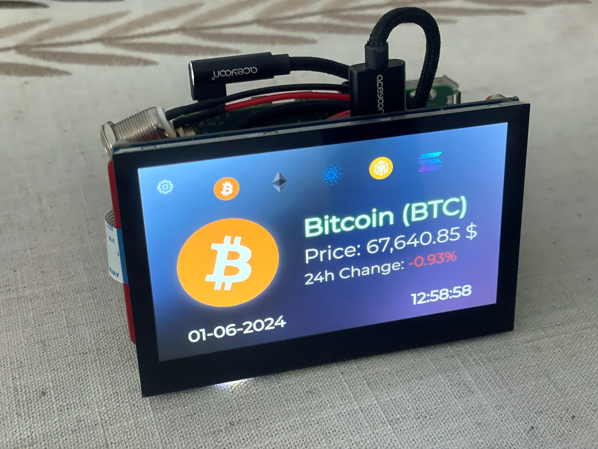

# CRYPTO DASHBOARD
Simple but beautiful Cryptocurrency Dashboard using the Binance API.
Interface well adapted for touch screens.

The main purpose of this exercise was to design a mini device based on Raspberry Pi with a 4.3" touch screen integrated by DSI and the most fun part of the project is to design the box using wood with some elegant design. (When I have it finished I will share it )

Includes a network manager (network.py) to use as a single App on a device.

**network.py** only works on Raspberry Pi using the PyWifi library 

<br><br>


<br><br>


<br><br>

## Install **requirements.txt**
    pip install -r requirements.txt
    sudo pip install requests
    sudo pip install pywifi
    sudo pip install screeninfo

## Run
    python crypto_dash.py
    
# Instructions to run it as a Single Device APP

## Install Image using Raspberry Pi Imager (Raspbian OS 64 bit)
- Configure settings in Pi Imager (SSH - WIFI - Login...)

## Main Settings

1. Run:
    ```sudo raspi-config```
    - Adjust VNC Resolution (Ex. 720x480 - 1280x720)
    - Enable VNC (I you want to control your RPi using VNC)

2. Update and upgrade the system:
    ```bash
    sudo apt-get update
    sudo apt-get upgrade -y
    sudo apt install realvnc-vnc-server realvnc-vnc-viewer -y
    ```

3. Adjust Swap File (Recommended for Raspberry Pi Zero 2W or lower devices):
    ```bash
    sudo dphys-swapfile swapoff
    sudo nano /etc/dphys-swapfile
    ```
    - Set `CONF_SWAPSIZE=2048`
    ```bash
    sudo dphys-swapfile setup
    sudo dphys-swapfile swapon
    ```

Check & Install PyQt5
    ```bash
    sudo apt install python3-pyqt5
    ```

## Enable Autostart
1. Navigate to `.config` directory and create `autostart` folder:
    ```bash
    cd .config
    sudo mkdir autostart
    sudo chmod +x autostart
    sudo nano crypto_dash.desktop
    ```
2. Add the following to `crypto_dash.desktop`:
    ```ini
    [Desktop Entry]
    Type=Application
    Name=CryptoDash
    Exec=python3 /home/pi/Desktop/CryptoDash/crypto_dash.py
    Comment=CryptoDash Script - Runs at Startup
    X-GNOME-Autostart-enabled=true
    ```
        sudo chmod +x crypto_dash.desktop

3. Disable Desktop UI (Comment out lines):
    ```bash
    sudo nano /etc/xdg/lxsession/LXDE-pi/autostart
    ```
    
4. Comment out the following lines:
    ```plaintext
    #@lxpanel --profile LXDE-pi
    #@pcmanfm --desktop --profile LXDE-pi
    #@xscreensaver -no-splash
    ```
5. Install unclutter (to hide mouse icon)
    ```
    sudo apt-get install unclutter
    ```
6. Add Unclutter to Startup
   ```
   cd .config/autostart
   sudo nano unclutter.desktop
   ```
   Add the following lines and save
   ```
    [Desktop Entry]
    Type=Application
    Name=Unclutter
    Exec=unclutter -idle 0.1
    X-GNOME-Autostart-enabled=true
     ```
   
